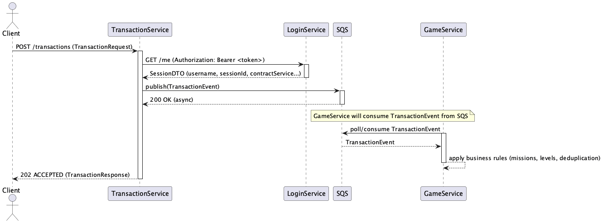

# Code documentation — EN

This document describes the main parts of `LoginService` and `TransactionService`, with class explanations and PlantUML class diagrams included.

## Quick instructions
- Diagrams: `login_service.puml` and `transaction_service.puml` (in the same folder).
- To generate a PDF (recommended on macOS): install `pandoc` and `plantuml` (or use the `generate_pdf.sh` script).

---

## Summary (LoginService)

1. `com.br.itau.login.LoginApplication` — Spring Boot entry point.
2. `controller.Login` (interface) and `controller.LoginImpl` — endpoints `/auth/login` and `/auth/me`.
3. `service.LoginService` / `service.LoginServiceImpl` — authentication flow: authenticate using `AuthenticationManager`, loads `UserAccount`, creates session (sessionId, symmetricKey) and generates JWT token via `JwtService`.
4. `service.JwtService` / `service.JwtServiceImpl` — handles JWT generation and validation (jjwt, HMAC key configured via `jwt.secret`).
5. `service.SessionServiceImpl` — reads/writes sessions in Redis using `RedisTemplate`.
6. `adapters.UserRepositoryAdapter` + `repository.UserAccountRepository` + `model.entity.UserAccount` — JPA persistence for users.
7. `model.SessionDTO` — DTO used to represent session stored in Redis and in tokens.

### Notes by file/class (summary)

- `LoginImpl` (controller): receives `LoginRequest` and delegates to `LoginService.login(...)`. `/me` returns session data from `@AuthenticationPrincipal`.

- `LoginServiceImpl`: authenticates via `AuthenticationManager.authenticate(...)`, retrieves user via `UserRepositoryDomain`, generates sessionId and symmetricKey via `SessionUtils`, saves session to Redis and creates JWT by calling `SessionUtils.createToken(...)`.

- `JwtServiceImpl`: creates token with claims `sessionId`, `role` and `contractService`. Validates signature with configured `jwt.secret` and exposes method to extract `Claims`.

- `SessionServiceImpl`: reads values from Redis and attempts to convert them to `SessionDTO` either directly or from a `Map` when a JSON serializer is used. Saves with TTL.

- `UserAccount` (entity): main fields: `id`, `username`, `password`, `nomeCompleto`, `email`, `contractService`, `role` (enum `Role`).

---

## Summary (TransactionService)

1. `com.transactionservice.TransactionServiceApplication` — Spring Boot entry point.
2. `controller.TransactionController` — POST `/transactions` endpoint that receives `TransactionRequest` and returns `TransactionResponse`.
3. `service.TransactionService` — core processing: validation, channel check (only MOBILE), session fetch from LoginService via `LoginClient`, publish event to SQS via `SqsProducer`, metrics (Micrometer) and error handling.
4. `infrastructure.client.LoginClient` — WebClient-based client to call `/me` endpoint of `LoginService`, with Resilience4j CircuitBreaker+Retry and configurable fail-fast/fail-open behavior.
5. `infrastructure.sqs.SqsProducer` — converts `TransactionEvent` to JSON and publishes to AWS SQS (`SqsClient`).
6. `dto.SessionDTO` — record that mirrors the session returned by `LoginService`.
7. `infrastructure.security.JwtDetails` — record keeping JWT-derived info for the Authentication object.

### Notes by file/class (summary)

- `TransactionService.processTransaction(...)`: checks `Authentication` from `SecurityContextHolder`, gets `customerId` and `JwtDetails`, validates channel, calls `fetchAndValidateSession(...)` which uses `LoginClient.getSession(...)` (remote), validates `contractService` and publishes the event to SQS.

- `LoginClient`: configures `loginServiceWebClient`, timeout and fallback policy. Depending on `feature-flags.login-service-fail-fast`, either throws `LoginServiceUnavailableException` or returns `null` (fail-open).

- `SqsProducer`: serializes `TransactionEvent` and calls `sqsClient.sendMessage(...)` with logging and exception handling.

---

## Sequence Diagram
The following sequence diagram shows the typical flow for a transaction:



Summary flow:
- Client -> `TransactionService` (POST /transactions)
- `TransactionService` -> `LoginService` (`/me`) to validate session
- `TransactionService` -> SQS (publish `TransactionEvent`)
- `GameService` -> SQS (consume events for gamification) — module still under development

Note: Gamification (GameService) is planned and will consume `TransactionEvent` from SQS to update missions, points and levels.

## Business Rules (high-level examples)
- Mission by range: missions that complete when a user reaches a range of transaction values (e.g., 5 PIX txns between 10 and 100 BRL)
- Avoid duplication: ensure the same `TransactionEvent.eventId` is not processed twice
- Monthly reset: reset mission counters/statistics at the start of each month
- Levels: assign points and levels to users based on transactions and completed missions

### GameService (proposed)
- Consumes events from SQS (`TransactionEvent`).
- Evaluates missions by type and range (e.g., count PIX transactions within value ranges).
- Controls duplication using `eventId` to avoid re-processing the same event.
- Maintains per-customer progress (missions state, points, redemption balances).
- Calculates monthly level based on accumulated points and resets counters according to the monthly reset rule.
- Controls benefit redemption: validates eligibility, decrements balances and records redemption transactions.

Note: `GameService` is a proposed gamification component; persistence choices (Redis, DynamoDB, RDS) should be decided based on scalability and latency requirements.

## TransactionEvent (JSON example)

```json
{
  "eventId": "uuid",
  "customerId": "...",
  "type": "PIX",
  "amount": 100,
  "timestamp": "...",
  "channel": "MOBILE"
}
```

## Resilience and strategies
- Circuit Breaker: protects the application from repeated failures of the `LoginService`, triggering fallbacks when needed.
- Retry: retries transient calls before falling back.
- Fail Fast vs Fail Open: configurable behavior in `LoginClient` — Fail Fast blocks transactions when `LoginService` is unavailable; Fail Open allows transactions to proceed without validation (risk).

---

## How to generate the PDF (recommended on macOS)
1. Install dependencies with Homebrew (if you don't have them):

```bash
brew install pandoc
brew install plantuml   # optional; the script can download plantuml.jar if missing
```

2. In the `docs/` folder run the script `generate_pdf.sh` (it renders diagrams and runs `pandoc` to create a PDF from Markdown including images).

Alternatively, use `generate_pdf_reportlab.py` to create a simple PDF without LaTeX.

---

End of EN document.
